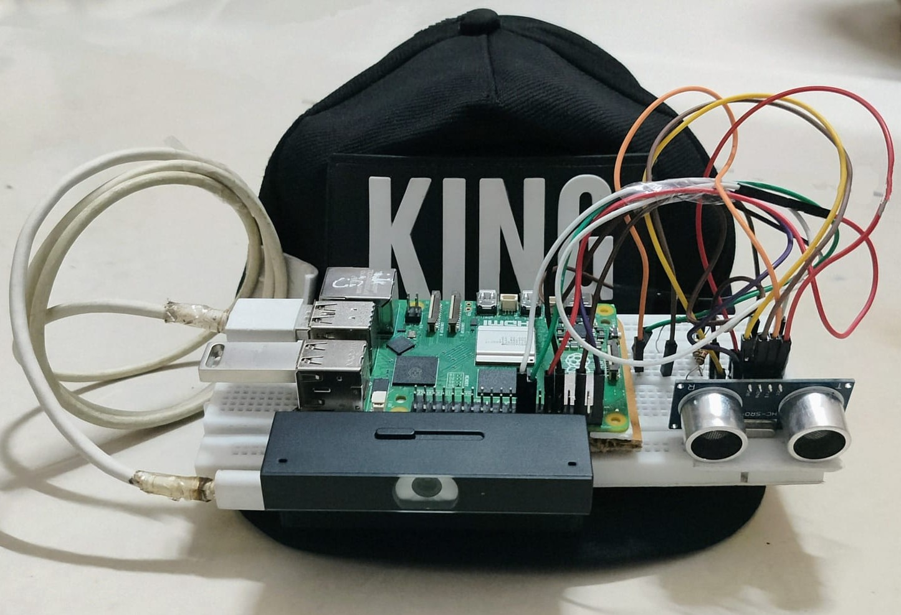

# Smart Assistive Navigation Device for Visually Impaired

This project implements a smart assistive device, **integrated into a wearable hat**, designed to enhance independent navigation for visually impaired individuals. It combines real-time object detection, distance measurement, GPS-based navigation, and voice interaction to provide comprehensive environmental awareness and guidance, all within a discreet and convenient form factor.

## Overview

The system, seamlessly housed within a hat, consists of a client device (running on a Raspberry Pi) and a remote server.

**Client (in `client/`)**

The client-side application captures real-time video and interacts with the user through voice commands. It features two primary modes:

* **Guidance Mode:**
    * Captures video frames from a camera.
    * Sends video frames to the remote server for object detection.
    * Receives and provides audio feedback on detected objects.
    * Uses an ultrasonic sensor to detect nearby obstacles and alerts the user with beeps.
* **Chat Mode:**
    * Utilizes OpenAI to engage in conversational interactions based on voice input.

The client listens for a wake word ("Hi siri") to activate and can be shut down with a "bye" command. It employs threading for concurrent operation and includes error handling and resource management.

**Server (in `server/`)**

The server-side application processes video frames for object detection and integrates this information with GPS navigation updates.

* **`main.py` (Server Main):**
    * Sets up a server to receive video frames from multiple clients.
    * Utilizes an object detection model (YOLOv8) to identify objects in the video streams.
    * Combines object detection results with GPS navigation updates (provided by the Flask server).
    * Sends the combined information back to the client as text.
    * Manages multiple clients concurrently using threads.
    * Runs a background Flask server (`gps_handler.py`) to handle GPS data.

* **`predictions.py` (Object Detection):**
    * Contains functions for processing video frames using a YOLO model to detect specific objects.
    * Identifies the closest detected object to the center of the frame.
    * Determines the object's relative position (left, right, or ahead).
    * Generates directional instructions for the client.
    * Implements logic to avoid repetitive reporting of the same object based on time and a delay.

* **`gps_handler.py` (GPS Navigation Server):**
    * Creates a Flask web server to provide GPS-based turn-by-turn navigation instructions.
    * Receives the user's current latitude and longitude via POST requests to the `/location` endpoint (likely from a mobile application).
    * Uses the Google Maps Directions API to calculate a route to a predefined destination.
    * Determines the next navigation instruction based on the user's current location and the route steps, considering distance to turning points or the destination.
    * Formats navigation instructions for clarity.
    * Uses a thread lock for safe access to location data.

## Network Setup

The Raspberry Pi (client) and the server need to be on the same network or accessible via a public IP address. This project was developed and tested using **Tailscale VPN**, which creates a secure private network allowing seamless communication between the mobile app, client, and server, regardless of their physical location.

## Functionality

This framework aims to provide visually impaired individuals with:

* **Real-time obstacle detection:** Identifying and alerting the user to nearby obstacles.
* **Object recognition:** Providing information about objects in the environment.
* **Turn-by-turn GPS navigation:** Guiding the user to their destination.
* **Voice interaction:** Enabling intuitive communication with the device for commands and information.

## Project Execution Requirements

**Hardware Requirements:**

* Raspberry Pi 5 (8GB recommended)
* Raspberry Pi Camera Module or compatible USB webcam
* Ultrasonic Sensor (HC-SR04) – for obstacle distance detection
* Buzzer – for proximity alerts
* Microphone Module – for voice command input
* Speaker / Earphones – for audio feedback (Google TTS output)
* Power Supply – Portable power bank (minimum 10,000 mAh)
* Wi-Fi connectivity – Required for Raspberry Pi to communicate with server
* Smartphone – To run GPS tracking app and send coordinates
* Optional: Breadboard, jumper wires, resistor (for ultrasonic circuit setup)

**Software Requirements:**

**On Raspberry Pi (Client Side):**

* **OS:** Raspberry Pi OS (32-bit recommended)
* **Python Version:** Python 3.8 or later
* **Required Python Libraries:** `pip install SpeechRecognition gtts playsound requests socket numpy pyaudio RPi.GPIO`
* **Google APIs:**
    * Google Speech-to-Text API
    * Google Text-to-Speech (gTTS)
* Flask Client (to interact with server)
* Mic & audio configuration (ALSA or PulseAudio)

**On Server (Object Detection & Navigation Logic):**

* **OS:** Windows/Linux (recommended: Ubuntu or any local machine)
* **Python Version:** Python 3.8 or later
* **Required Python Libraries:** `pip install flask ultralytics opencv-python numpy requests geopy`
* **YOLOv8 Model Files:**
    * Install Ultralytics: `pip install ultralytics`
    * Use pre-trained model: `yolov8n.pt` or `yolov8s.pt`

**On Mobile (GPS Tracking App):**

* Mobile app
* Send location data to the server via REST API POST (Flask route)
* **Smartphone must have:**
    * GPS turned ON
    * Mobile data/Wi-Fi enabled

**Other Essentials:**

* Raspberry Pi and server must be on the same network or accessible via public IP.
* Update IP addresses in the socket/client/server scripts as per your setup.

## Authors

- Joe Mathew
- Joel Kurian Abraham
- Nived Tharun
- Muhammed Jasim PT
